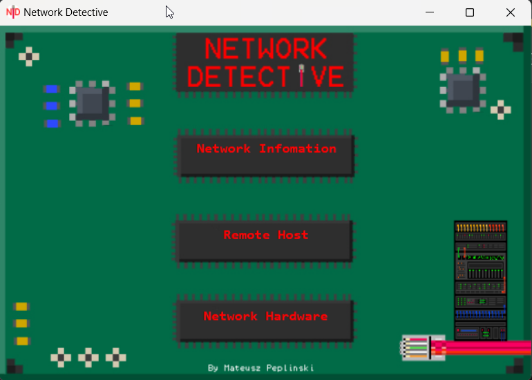
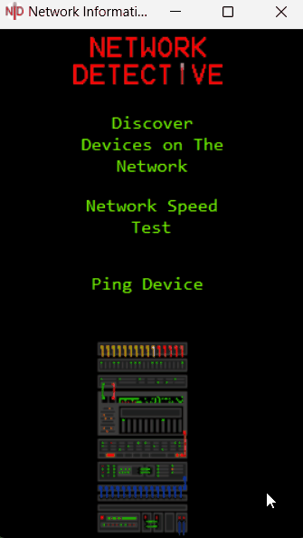
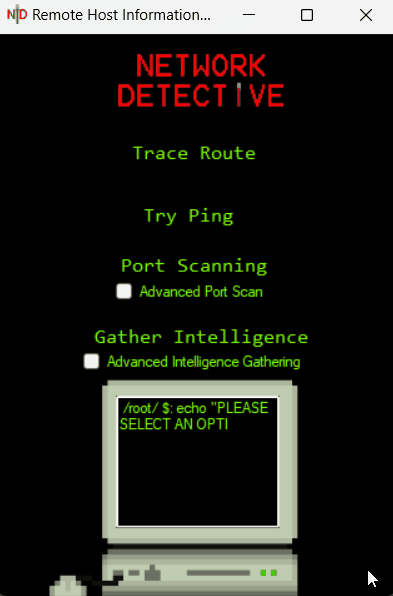
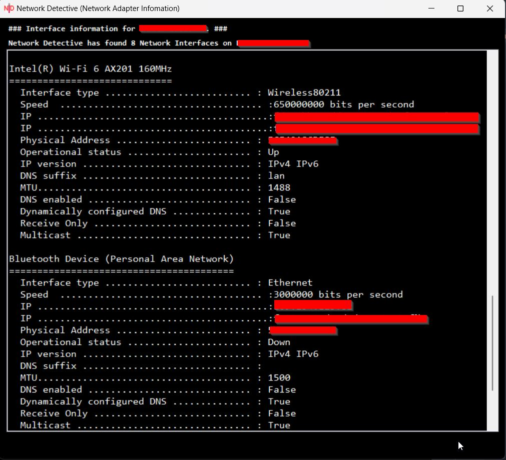

  

 

<h3 align="center">By: Mateusz Peplinski</h3>

<h5 align="center"> Network Detective is a general purpose network information gathering tool. [IN PROGRESS]</h5>

  
 

 
  
  <table>
  <tr>
    <td>Network Information Menu</td>
     <td>Remote Host Menu</td>
     <td>Network Hardware Information</td>
  </tr>
  <tr>
    <td></td>
    <td></td>
    <td></td>
  </tr>
 </table>
Future Updates:

--> Basic Network Packet Capture  
--> IEEE 802.11 Deauthentication Attack
